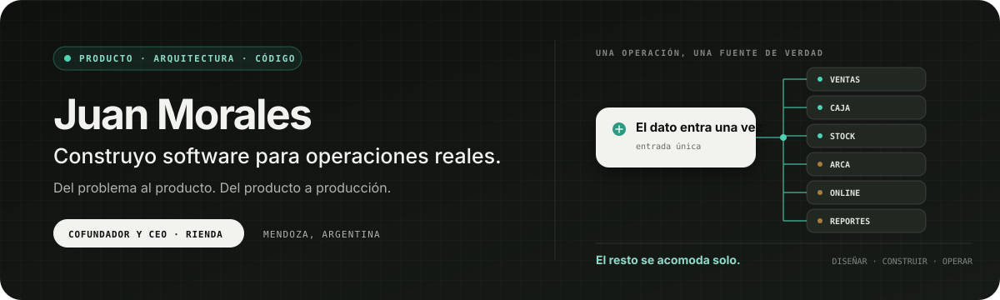
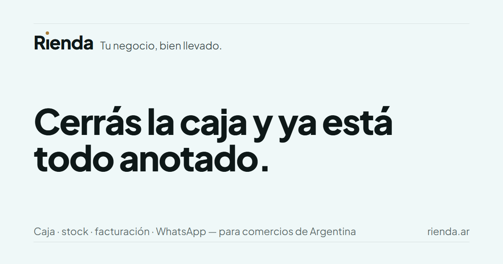
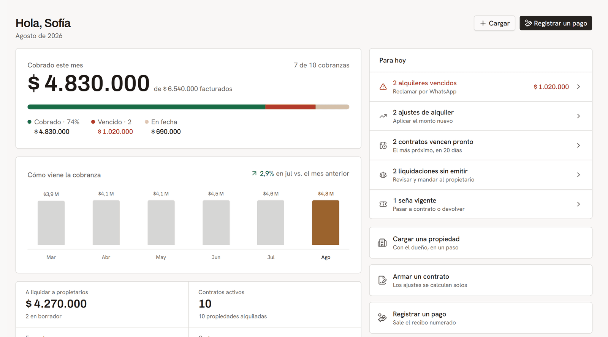
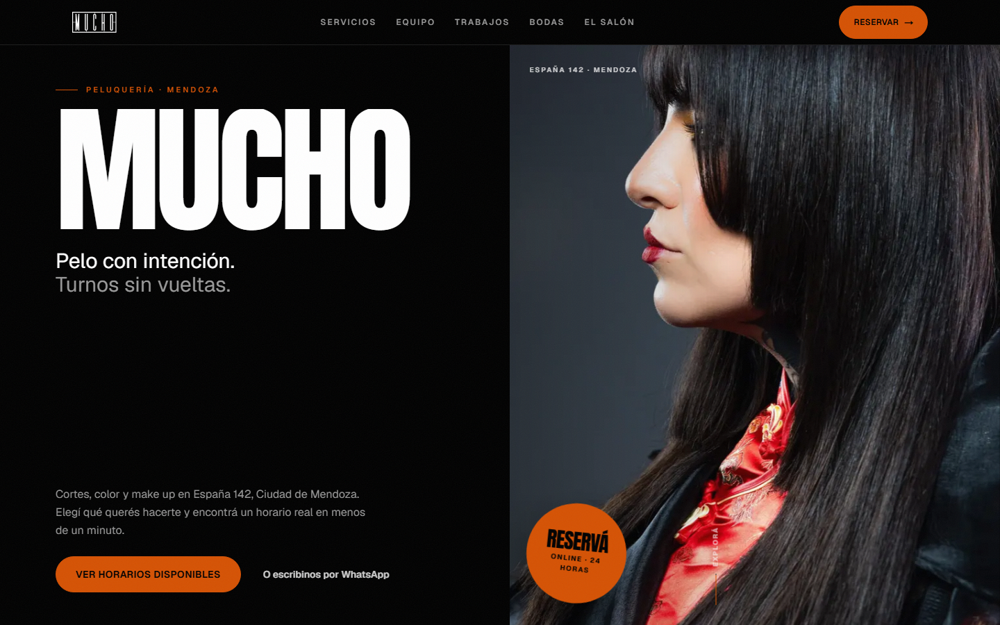

<p align="center">
  
</p>

<p align="center">
  <a href="https://juan-morales-portfolio.vercel.app"><strong>Portfolio</strong></a>
  &nbsp;·&nbsp;
  <a href="https://rienda.ar"><strong>Rienda</strong></a>
  &nbsp;·&nbsp;
  <a href="https://www.linkedin.com/in/juan-morales1/"><strong>LinkedIn</strong></a>
  &nbsp;·&nbsp;
  <a href="mailto:juanmoralesp19@gmail.com"><strong>Contacto</strong></a>
</p>

Soy cofundador y CEO de **[Rienda](https://rienda.ar)**. Diseño y construyo productos digitales para negocios que necesitan vender, cobrar, coordinar y decidir sin reconciliar sistemas separados.

Trabajo de punta a punta: entiendo el problema, defino el producto, diseño la experiencia, elijo la arquitectura, escribo el código y acompaño la operación en producción. Mi tesis es simple: **el dato se carga una vez y el resto se acomoda solo**.

## Productos en funcionamiento

<a href="https://rienda.ar">
  
</a>

### [Rienda](https://rienda.ar)

Plataforma integral para comercios argentinos: ventas, caja, stock, facturación electrónica con ARCA, canales online y reportes dentro de una sola operación.

**Mi rol:** cofundador y CEO; producto, arquitectura, desarrollo y operación.<br>
**Ver:** [producto](https://rienda.ar) · [caso de estudio](https://juan-morales-portfolio.vercel.app/proyectos/rienda)

<table>
  <tr>
    <td width="50%" valign="top">
      <a href="https://juan-morales-portfolio.vercel.app/proyectos/llavero">
        
      </a>
      <h3><a href="https://juan-morales-portfolio.vercel.app/proyectos/llavero">Llavero</a></h3>
      <p>Gestión para inmobiliarias: alquileres, ajustes por índice, cobranzas, liquidaciones, CRM y difusión en portales.</p>
      <p><strong>Producto · arquitectura · desarrollo</strong></p>
    </td>
    <td width="50%" valign="top">
      <a href="https://juan-morales-portfolio.vercel.app/proyectos/mucho-peluqueria">
        
      </a>
      <h3><a href="https://juan-morales-portfolio.vercel.app/proyectos/mucho-peluqueria">Mucho Peluquería</a></h3>
      <p>Turnos por web, WhatsApp y mostrador sobre una sola agenda, con la prevención de dobles reservas garantizada en la base de datos.</p>
      <p><strong>Producto para cliente · entrega en producción</strong></p>
    </td>
  </tr>
</table>

<sub>Las pantallas operativas muestran datos ficticios o de demostración.</sub>

### Otros sistemas

- **[Portal Poltrona](https://juan-morales-portfolio.vercel.app/proyectos/portal-poltrona)** — presupuestos y cobros con cifrado en el navegador para una tienda de muebles.
- **[Ahorrito](https://juan-morales-portfolio.vercel.app/proyectos/ahorrito)** — finanzas personales para Argentina con clasificación asistida por inteligencia artificial.

## Cómo trabajo

| Producto | Construcción | Operación |
|---|---|---|
| Empiezo por el problema y el flujo real del negocio. | Convierto decisiones en interfaces, reglas e integraciones mantenibles. | Mido la calidad donde importa: seguridad, datos y comportamiento en producción. |

```text
problema real → una fuente de verdad → operación conectada → evidencia en producción
```

## Capacidades

**Producto** — estrategia, definición de problemas, diseño de experiencias y operación SaaS<br>
**Desarrollo** — Next.js, React, TypeScript, PostgreSQL, Prisma y Tailwind CSS<br>
**Integraciones** — ARCA, WhatsApp, pagos y canales de venta online<br>
**Inteligencia artificial** — RAG, automatización y herramientas con IA aplicadas a procesos reales

No uso inteligencia artificial para reemplazar criterio. La uso para acelerar investigación, diseño, desarrollo y operación; las reglas críticas quedan expresadas y verificadas en el sistema.

## Código y casos de estudio

El código de los productos vive principalmente en repositorios privados. La evidencia pública —pantallas, decisiones, arquitectura y resultados— está documentada en mi **[portfolio](https://juan-morales-portfolio.vercel.app/proyectos)**.

El portfolio también tiene un repositorio público: **[JuanMorales10/juan-morales-portfolio](https://github.com/JuanMorales10/juan-morales-portfolio)**.

---

Si estás construyendo un producto o querés ordenar una operación compleja, podemos conversar: **[juanmoralesp19@gmail.com](mailto:juanmoralesp19@gmail.com)**.
